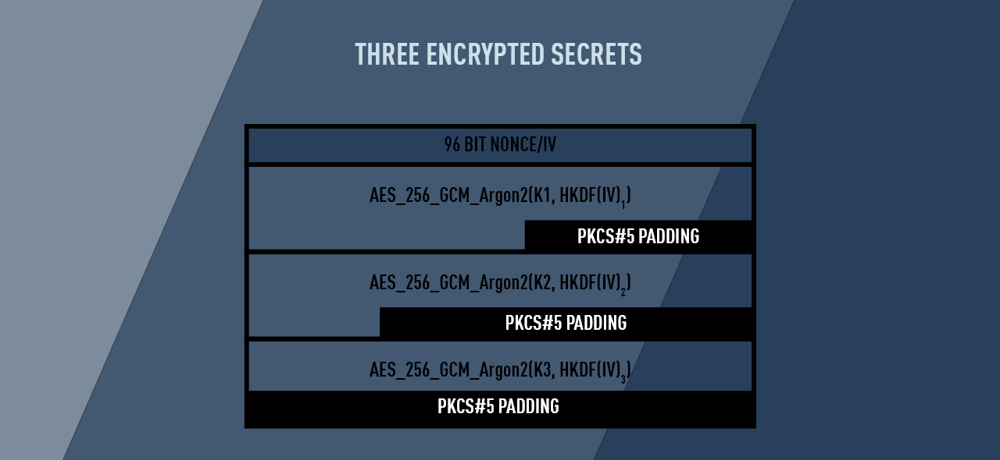
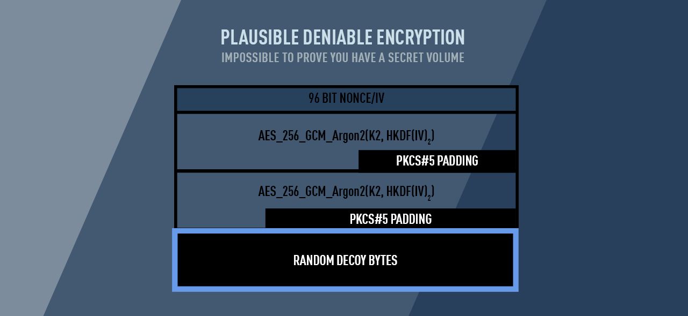

#  UnknownAccess

UnknownAccess is a plausible deniable secret encryption scheme. Utilising; AES_256_GCM Argon2Key KDF and HKDF. It allows you to store upto 3 unique secrets; Cryptocurrency seeds, 2FA codes, Passwords etc, in a single output of ciphertext. Depending on the key used to decrypt, the outputted secret will be different.

This allows you to handover a decoy secret (e.g. Bitcoin seed) to an adversary, without the adversary being able to prove the secret is a decoy. Intern, allowing you to maintain privacy, even when being physically coerced.

---

---

## Security Guarantees
- No one can infer how many encrypted volumes are in use.
	- Even if k1 or k2 or k3 is compromised.
- 256bit AES symmetric encryption.
- ASIC resistant, GPU resistant using Argon2 KDF
- Rainbow table resistant (via use of salt/nonce unique to each secret data block)

---

*Note position/order of encrypted volumes/"data blocks" are randomised and volume sizes are fixed to deny any inference on the amount of hidden volumes and volume sizes*

---